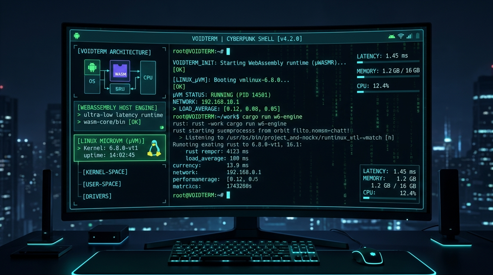
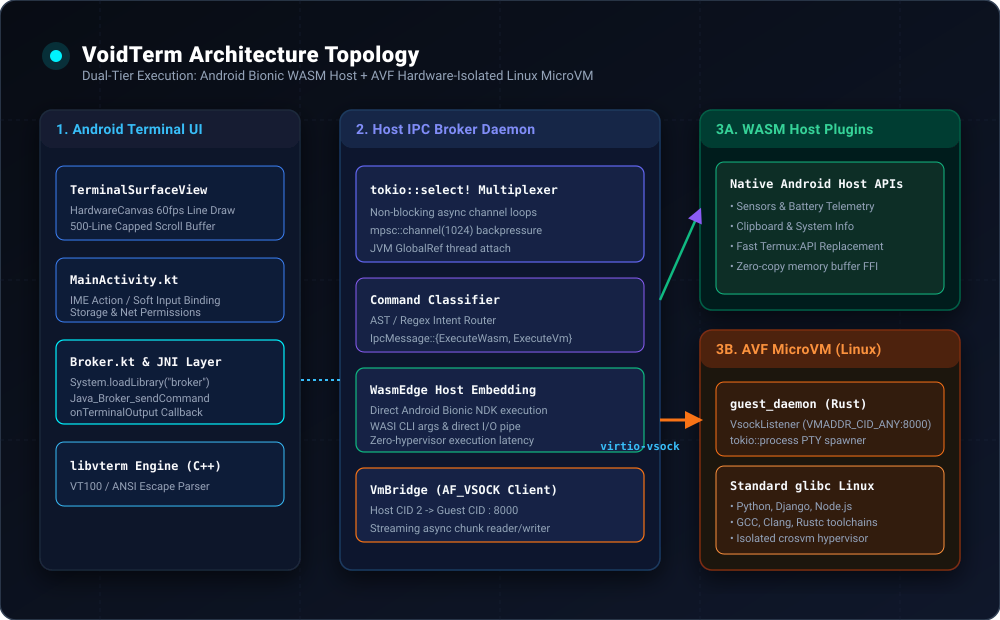
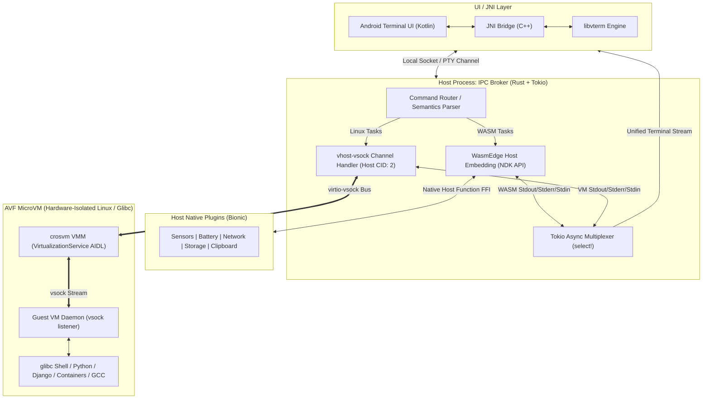

# VoidTerm Shell Terminal

<p align="center">
  
</p>

<p align="center">
  
  
  
  
  
</p>

**VoidTerm Shell Terminal** is a high-performance, dual-tier Android terminal and execution environment. It bridges ultra-low latency host-native execution with full Linux environment compatibility through a multi-tier architecture.

---

## 🏛️ System Architecture Topology

<p align="center">
  
</p>



---

## Key Subsystems

1. **Terminal UI / JNI Layer (`android/app`)**:
   - Monospace hardware-accelerated `SurfaceView` rendering at 60fps.
   - Synchronized line buffer with low-latency JNI bridge to the Rust daemon.
2. **IPC Broker Daemon (`hybrid-term-broker`)**:
   - Asynchronous Rust daemon built on `tokio`.
   - Dynamic routing of lightweight tasks to Host WASM and heavy computational workloads to the AVF Guest VM.
3. **Host WASM Engine (WasmEdge NDK)**:
   - Zero-hypervisor-overhead execution of WebAssembly bytecode directly on Android Bionic.
   - Native capability plugins (telemetry, storage, sensors).
4. **Guest Linux Engine (AVF + crosvm)**:
   - Hardware-isolated microVM managed via Android's `VirtualizationService`.
   - Native `glibc` ELF binary execution without emulation penalties.
5. **Hypervisor Bus (`virtio-vsock`)**:
   - Low-latency, zero-network-overhead socket communication between Host (CID 2) and Guest microVM.

---

## Directory Structure

```
.
├── assets/                  # High-resolution banner & vector architecture SVG
│   ├── banner.jpg
│   └── architecture.svg
├── .github/workflows/ci.yml # Automated CI pipeline (Rust check & Android APK build)
├── .gitignore               # Unified Cargo and Gradle build exclusions
├── AGENTS.md                # Repository governance & operational directives
├── CONTEXT.md               # Living architecture & event logging matrix
├── Cargo.toml               # Cargo workspace root
├── android/                 # Android Terminal Application
│   └── app/
│       └── src/main/
│           ├── AndroidManifest.xml
│           ├── kotlin/com/hybridengine/terminal/
│           │   ├── Broker.kt
│           │   ├── MainActivity.kt
│           │   └── TerminalSurfaceView.kt
│           └── res/
│               ├── layout/activity_main.xml
│               └── values/strings.xml
└── hybrid-term-broker/      # Rust IPC broker daemon & hypervisor bridge
    ├── Cargo.toml
    └── src/
        ├── bin/guest_daemon.rs
        ├── lib.rs
        ├── main.rs
        ├── vm_bridge.rs
        └── wasm_engine.rs
```

---

## Building & Verification

### Rust Daemon
```bash
cd hybrid-term-broker
cargo check
cargo build --target aarch64-linux-android
```

### Android Application
```bash
./gradlew assembleDebug
```

---

## License
Apache-2.0 / MIT
